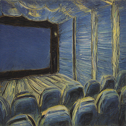
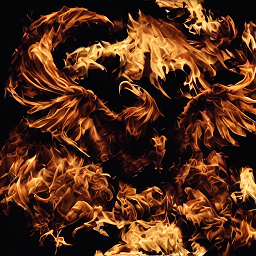
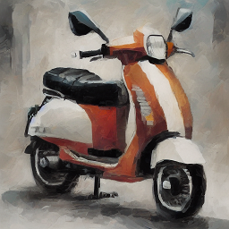

# 计图挑战赛实验报告

- [计图挑战赛实验报告](#计图挑战赛实验报告)
  - [Method](#method)
    - [Dreambooth](#dreambooth)
    - [StyleID (Style Injection with Diffusion)](#styleid-style-injection-with-diffusion)
  - [Summerize](#summerize)
  - [Result](#result)
  - [Members](#members)
  - [Reference](#reference)
    - [Websites](#websites)
    - [Paper](#paper)

## Method

### Dreambooth

Dreambooth 即为 Baseline 提供的方法，报告希望将讲述重点放在本组额外使用的方法上

### StyleID (Style Injection with Diffusion)

1. 整体思路：
    - StyleID 有两个输入了，其一为风格图片，其二为待转换风格的图片（我们用 Baseline 的输出作为待转换风格的图片，以进一步加强输出和参考风格的关联）
    - 首先，将两张图片分别进行 DDIM Inversion, 在进行加噪的过程中，将每一步 unet 中计算 self-attention 所用的 q, k, v 的值提取出来
    - 随后，将加噪得到的两个 latent noise 进行叠加
    - 最后，利用前面所得的 q, k, v 的值，引导对叠加得到的 latent noise 的 DDIM Reversion, 得到最终输出
    - 每个风格我们随机抽取了一张作为 StyleID 的 style image 输入
2. 在加噪和降噪两个过程中，只需要对 unet 的 up_blocks 的后六个 Spatial Transformer 块的 Self-Attention 块进行修改，为如下部分：

    ```python
    list_attn = ['up_blocks.2.attentions.0.transformer_blocks.0.attn1.processor',
                'up_blocks.2.attentions.1.transformer_blocks.0.attn1.processor',
                'up_blocks.2.attentions.2.transformer_blocks.0.attn1.processor',
                'up_blocks.3.attentions.0.transformer_blocks.0.attn1.processor',
                'up_blocks.3.attentions.1.transformer_blocks.0.attn1.processor',
                'up_blocks.3.attentions.2.transformer_blocks.0.attn1.processor']
    ```

3. DDIM Inversion
    - 在 SD21 上使用 DDIMScheduler 进行加噪
        - 原理
            - 加噪过程基于如下公式：

                

            - 其中，使用`v`是因为 SD21 的 unet 为`v_prediction`模式，需要额外计算，将其转换为预测的噪声
        - Code：

            ```python
            def ddim_inversion(img: jt.Var) -> jt.Var:
                timesteps = jt.Var(np.flip(pipeline.scheduler.timesteps))
                
                # abtain initial noise of the inpur image
                latents = 0.1875 * pipeline.vae.encode(img).latent_dist.sample()
                # using empty string as text_embdding
                text_embeddings = pipeline._encode_prompt(prompt='', device=device, num_images_per_prompt=1, do_classifier_free_guidance=True)
                
                for i in tqdm(range(0, arguments.step_num), desc='DDIM Inversion', total=arguments.step_num):
                    t = timesteps[i]
                    
                    latent_model_input = jt.cat([latents] * 2)
                    latent_model_input = pipeline.scheduler.scale_model_input(latent_model_input, t)
                    
                    # prediction type of SD21 is 'v_prediction'
                    v_pred = pipeline.unet(latent_model_input, t, encoder_hidden_states=text_embeddings).sample
                    
                    t_cur = max(1, t.item() - (1000 // arguments.step_num))
                    t_nxt = t
                    a_cur = pipeline.scheduler.alphas_cumprod[t_cur]
                    a_nxt = pipeline.scheduler.alphas_cumprod[t_nxt]

                    # using 'v_prediction' to compute predicted noise
                    noise_pred = a_cur.sqrt() * v_pred.chunk(2)[0] + (1.0 - a_cur).sqrt() * latents
                    latents = a_nxt.sqrt() * (latents - (1.0 - a_cur).sqrt() * noise_pred) / a_cur.sqrt() + (1.0 - a_nxt).sqrt() * noise_pred
                    
                return latents
            ```

    - 使用 AttnProcessor 修改 unet 部分结构的 Attention 块
        - 原理：继承`diffusers.attention_processors.AttnProcessor`类，重写`__call__`函数，在计算出 q, k, v 值的时候进行保存即可
        - Code：

            ```python
            class SaveFeatureAttnProcessor(AttnProcessor):
                def __init__(self, is_sty_img=True):
                    super().__init__()
                    self.sty_img = is_sty_img
                    # for style images, we need to save 'key' and 'value'
                    if self.sty_img:
                        self.ft_dict = [[],[]]
                    # for content images, save 'query' only
                    else:
                        self.ft_dict = []
                
                def __call__(
                    self,
                    attn: Attention,
                    hidden_states: jt.Var,
                    encoder_hidden_states: Optional[jt.Var] = None,
                    attention_mask: Optional[jt.Var] = None,
                    temb: Optional[jt.Var] = None,
                    scale: float = 1.0,
                ) -> jt.Var:
                    residual = hidden_states

                    args = () if USE_PEFT_BACKEND else (scale,)

                    if attn.spatial_norm is not None:
                        hidden_states = attn.spatial_norm(hidden_states, temb)

                    input_ndim = hidden_states.ndim

                    if input_ndim == 4:
                        batch_size, channel, height, width = hidden_states.shape
                        hidden_states = hidden_states.view(batch_size, channel, height * width).transpose(1, 2)

                    batch_size, sequence_length, _ = (
                        hidden_states.shape if encoder_hidden_states is None else encoder_hidden_states.shape
                    )
                    attention_mask = attn.prepare_attention_mask(attention_mask, sequence_length, batch_size)

                    if attn.group_norm is not None:
                        hidden_states = attn.group_norm(hidden_states.transpose(1, 2)).transpose(1, 2)

                    query = attn.to_q(hidden_states, *args)

                    if encoder_hidden_states is None:
                        encoder_hidden_states = hidden_states
                    elif attn.norm_cross:
                        encoder_hidden_states = attn.norm_encoder_hidden_states(encoder_hidden_states)

                    key = attn.to_k(encoder_hidden_states, *args)
                    value = attn.to_v(encoder_hidden_states, *args)
                    
                    # save q, k, v features
                    if self.sty_img:
                        self.ft_dict[0].append(key)
                        self.ft_dict[1].append(value)
                    else:
                        self.ft_dict.append(query)

                    query = attn.head_to_batch_dim(query)
                    key = attn.head_to_batch_dim(key)
                    value = attn.head_to_batch_dim(value)

                    attention_probs = attn.get_attention_scores(query, key, attention_mask)
                    hidden_states = torch.bmm(attention_probs, value)
                    hidden_states = attn.batch_to_head_dim(hidden_states)

                    # linear proj
                    hidden_states = attn.to_out[0](hidden_states, *args)
                    # dropout
                    hidden_states = attn.to_out[1](hidden_states)

                    if input_ndim == 4:
                        hidden_states = hidden_states.transpose(-1, -2).reshape(batch_size, channel, height, width)

                    if attn.residual_connection:
                        hidden_states = hidden_states + residual

                    hidden_states = hidden_states / attn.rescale_output_factor

                    return hidden_states
            ```

4. 噪音叠加：AdaIN
    - 对于噪音的叠加，需要考虑两方面的因素，其一，需要保证输出图片的色调信息和 Style image 一致；其二，需要保证输出图片的内容和 content image 一致
    - 采用名为`AdaIN`的方法进行叠加：

        

        其中，μ 为均值，σ 为标准差，c 代表 content image，s 代表 style image

    - Code：

        ```python
        def adain(sty_latent: jt.Var, cnt_latent: jt.Var) -> jt.Var:
            sty_np = np.asarray(sty_latent)
            cnt_np = np.asarray(cnt_latent)

            sty_mean = sty_np.mean(axis=2, keepdims=True).mean(axis=3, keepdims=True)
            cnt_mean = cnt_np.mean(axis=2, keepdims=True).mean(axis=3, keepdims=True)
            sty_std = sty_np.std(axis=2, keepdims=True).mean(axis=3, keepdims=True)
            cnt_std = cnt_np.std(axis=2, keepdims=True).mean(axis=3, keepdims=True)

            sty_mean = jt.Var(sty_mean)
            cnt_mean = jt.Var(cnt_mean)
            sty_std = jt.Var(sty_std)
            cnt_std = jt.Var(cnt_std)

            return sty_std * (cnt_latent - cnt_mean) / cnt_std + sty_mean
        ```

5. DDIM Reversion
    - 降噪过程基于如下公式：

        

    - 对于降噪过程，self-attention 计算修改为如下方式：

        

    - 在上图中，由 style image 提供 k, v, 由 content image 和 stylized image 共同提供 q，用公式表达如下：

        

    - 其中，T 用于提高锐度，防止输出图像过于模糊
    - 对于代码实现，继承`diffusers.attention_processors.AttnProcessor`类，在`__init__()`函数中加载 Inversion 过程中计算的特征；随后重写`__call__`函数，按照上文的公式，进行计算即可
    - Code：

        ```python
        class StyleInjectAttnProcessor(AttnProcessor):
            def __init__(self, _sty_ft: list[list], _cnt_ft: list):
                super().__init__()
                self.sty_ft = _sty_ft
                self.cnt_ft = _cnt_ft
                self.gamma = 0.75
                self.T = 1.8
                self.reverse_step = 0
            
            def __call__(
                self,
                attn: Attention,
                hidden_states: jt.Var,
                encoder_hidden_states: Optional[jt.Var] = None,
                attention_mask: Optional[jt.Var] = None,
                temb: Optional[jt.Var] = None,
                scale: float = 1.0,
            ) -> jt.Var:
                residual = hidden_states

                args = () if USE_PEFT_BACKEND else (scale,)

                if attn.spatial_norm is not None:
                    hidden_states = attn.spatial_norm(hidden_states, temb)

                input_ndim = hidden_states.ndim

                if input_ndim == 4:
                    batch_size, channel, height, width = hidden_states.shape
                    hidden_states = hidden_states.view(batch_size, channel, height * width).transpose(1, 2)

                batch_size, sequence_length, _ = (
                    hidden_states.shape if encoder_hidden_states is None else encoder_hidden_states.shape
                )
                attention_mask = attn.prepare_attention_mask(attention_mask, sequence_length, batch_size)

                if attn.group_norm is not None:
                    hidden_states = attn.group_norm(hidden_states.transpose(1, 2)).transpose(1, 2)

                # q~ = gamma * q_load + (1 - gamma) * q
                query = self.gamma * self.cnt_ft[len(self.cnt_ft) - 1 - self.reverse_step] + (1.0 - self.gamma) * attn.to_q(hidden_states, *args)
                query = query * self.T

                if encoder_hidden_states is None:
                    encoder_hidden_states = hidden_states
                elif attn.norm_cross:
                    encoder_hidden_states = attn.norm_encoder_hidden_states(encoder_hidden_states)

                # load k and v
                key = self.sty_ft[0][len(self.sty_ft) - 1 - self.reverse_step]
                value = self.sty_ft[1][len(self.sty_ft) - 1- self.reverse_step]

                query = attn.head_to_batch_dim(query)
                key = attn.head_to_batch_dim(key)
                value = attn.head_to_batch_dim(value)
                self.reverse_step += 1

                attention_probs = attn.get_attention_scores(query, key, attention_mask)
                hidden_states = torch.bmm(attention_probs, value)
                hidden_states = attn.batch_to_head_dim(hidden_states)

                # linear proj
                hidden_states = attn.to_out[0](hidden_states, *args)
                # dropout
                hidden_states = attn.to_out[1](hidden_states)

                if input_ndim == 4:
                    hidden_states = hidden_states.transpose(-1, -2).reshape(batch_size, channel, height, width)

                if attn.residual_connection:
                    hidden_states = hidden_states + residual

                hidden_states = hidden_states / attn.rescale_output_factor

                return hidden_states

        def ddim_reversion(start_latents: jt.Var, device=device) -> jt.Var:
            dict_attn = {}
            attn_processors = pipeline.unet.attn_processors
            j = 0
            for i in attn_processors.keys():
                if i in list_attn:
                    dict_attn[i] = StyleInjectAttnProcessor(_sty_ft=sty_ft[j], _cnt_ft=cnt_ft[j])
                    j += 1
                else:
                    dict_attn[i] = AttnProcessor()
            pipeline.unet.set_attn_processor(dict_attn)
            
            timesteps = pipeline.scheduler.timesteps
            
            latents = start_latents.clone()
            text_embeddings = pipeline._encode_prompt(prompt='', device=device, num_images_per_prompt=1, do_classifier_free_guidance=True)
            
            for i in tqdm(range(0, arguments.step_num), desc='DDIM Reversion', total=arguments.step_num):
                t = timesteps[i]
                
                latent_model_input = jt.cat([latents] * 2)
                latent_model_input = pipeline.scheduler.scale_model_input(latent_model_input, t)
                
                v_pred = pipeline.unet(latent_model_input, t, encoder_hidden_states=text_embeddings).sample

                prev_t = max(0, t.item() - (1000 // arguments.step_num))
                a_cur = pipeline.scheduler.alphas_cumprod[t.item()]
                a_pre = pipeline.scheduler.alphas_cumprod[prev_t]
                
                noise_pred = a_pre.sqrt() * v_pred.chunk(2)[0] + (1.0 - a_pre).sqrt() * latents
                pred_x0 = (latents - (1 - a_cur).sqrt() * noise_pred) / a_cur.sqrt()
                drc_xt = (1 - a_pre).sqrt() * noise_pred
                
                latents = a_pre.sqrt() * pred_x0 + drc_xt
                
            return latents
        ```

## Summerize

1. 对于 Dreambooth，我们尝试过通过优化 prompt, 调整微调训练迭代次数来优化不同类的生成结果
    - 其中，前者作用并不是很大，在很多情况下，生成内容和提示词并不吻合（如提示词为芒果，但是生成的是瓶子，在生成 park, school 等场景类的词的时候尤为明显），我们猜测可能是由于 SD21 的文意理解能力有限，需要通过其他方法进行输出的指导
    - 后者在 style11 (石头浮雕风格)取得了很好的效果：在迭代次数为 1000 的情况下，由于 style11 的训练图片均为动物，故训练微调导致 overfitting，输入任何提示词，输出基本均为动物；将迭代次数降至 250 后，生成效果明显更优，既保留了风格，又保留了生成不同内容的能力
2. 对于 StyleID
    - 原作者 StyleID 是在 SD14 上实现的，其 unet 和 SD21 的 unet 结构虽一致，但是预测模式不同，前者为`epsilon`模式，后者为`v_prediction`模式；在最初实现的时候，由于忽略了这一点，加噪和降噪过程进行失败
    - 原作者 StyleID 没有用任何库，手写的 ldm，导致在移植的时候查阅代码极度痛苦，不过好在还是成功了，也通过这个更进一步了解了 SD 的网络结构和细节
3. 在后续工作中，我们计划使用额外的方法微调训练 SD，保证输出和 style 和 prompt 同时对齐

## Result

1. 截止 6.30 23:30，小组提交的结果排名如下，位列第三

    

2. 部分生成结果展示
    - style00：cinema

        

    - style02：bamboo

        

    - style05：beach

        

    - style07：eagle

        

    - style11：ship

        

    - style13：scooter

        

## Members

1. 孙昌勖 2021012754（队长）：
    - baseline 调试
    - Style Align 方法测试（计划后续使用于 B 榜）
    - StyleID 方法测试并使用 Jittor 实现
2. 汪钰涵 2022012241：
    - baseline 调试
    - 针对不同类和图片，生成合适的 prompt (positive and negative)，优化 baseline 输出效果
3. 方奔皓 2021012747：
    - baseline 调试
    - baseline 结果生成
    - Style Align 方法测试

## Reference

### Websites

1. JDiffusion and Baseline [here](https://github.com/JittorRepos/JDiffusion)
2. Stable Diffusion 2-1 [here](https://huggingface.co/stabilityai/stable-diffusion-2-1)
3. An Interpretion to SD [here](https://zhuanlan.zhihu.com/p/617134893)
4. Style Align Project Page [here](https://style-Align-gen.github.io/)
5. StyleID github repository [here](https://github.com/jiwoogit/StyleID), this is our `important reference` for JStyleID based on this code.
6. `DDIMScheduler` [here](https://hf-mirror.com/docs/diffusers/api/schedulers/ddim)
7. Attention blocks of the U-Net of SD [here](https://zhouyifan.net/2024/01/27/20240123-SD-Attn/)

### Paper

1. [Denosing Diffusion Probabilistic Models](https://arxiv.org/pdf/2006.11239)
2. [Denoising Diffusion Implicit Models](https://arxiv.org/pdf/2010.02502)
3. [High-Resolution Image Synthesis with Latent Diffusion Models](https://arxiv.org/pdf/2112.10752)
4. [Style Align Image Generation via Shared Attention](https://arxiv.org/pdf/2312.02133)
5. [Style Injection in Diffusion: A Training-free Approach for Adapting Large-scale Diffusion Models for Style Transfer](https://arxiv.org/pdf/2312.09008)
6. [Imagen Video: High Definition Video Generation with Diffusion Models](https://imagen.research.google/video/paper.pdf)
